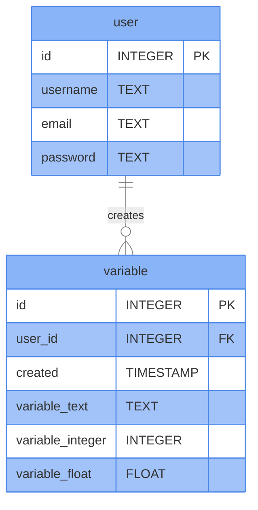

```mermaid
%%{init: {'theme': 'base', 'themeVariables': { 
    'textColor': 'black', 
    'primaryColor': '#8ab4f8',
    'primaryBorderColor':'#4a86e8', 
    'tertiaryColor': 'gainsboro',
    'lineColor': 'grey'
    }}}%%
erDiagram
    user ||--o{ variable : creates
    user {
        id INTEGER PK
        username TEXT
        email TEXT
        password TEXT
    }
    variable {
        id INTEGER PK
        user_id INTEGER FK
        created TIMESTAMP
        variable_text TEXT
        variable_integer INTEGER
        variable_float FLOAT
    }
```